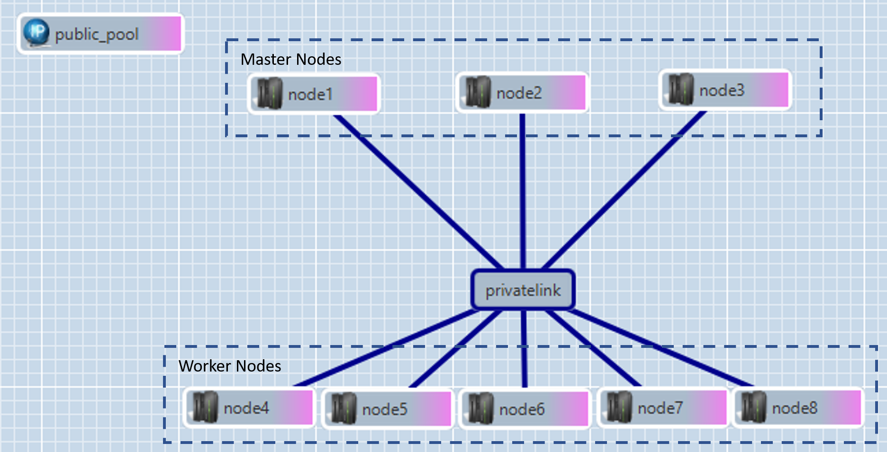

# Kubernetes ansible ugent
## Project
This repo was created as part of our VOP-project **Kubernetes**.
In this repo we explore how to setup a bare metal kubernetes cluster with High Availability enabled on the [imec-virtualwall](https://doc.ilabt.imec.be/ilabt/virtualwall/index.html).

After setting up the cluster, please checkout https://github.com/vop-2020-kubernetes/k8s-deployment. In that repo we gathered all information on what applications we deployed an what apps solve what problems.

## Roles
|                    | tasks      | description                                | path  |
|--------------------|------------|--------------------------------------------|-------|
| :books: common     | main       | update cluster nodes configuration by calling the other tasks, is tuned to work on [imec-virtualwall](https://doc.ilabt.imec.be/ilabt/virtualwall/index.html) | [main.yml](roles/common/tasks/main.yml)
|                    | networking | configure networking, using netplan; creating a nat default route and renaming network interfaces | [networking.yml](roles/common/tasks/networking.yml)
|                    | swap       | disable swap and update fstab | [swap.yml](roles/common/tasks/swap.yml)
|                    | disk       | expand main disk and create ceph partition | [disk.yml](roles/common/tasks/disk.yml)
|                    | grub       | update grub and run in initramfs > this will help renaming the network interfaces | [grub.yml](roles/common/tasks/grub.yml)
|                    | update     | update all installed packages | [update.yml](roles/common/tasks/update.yml)
| :zap: hacluster    | main       | setup a ha-cluster by running tasks below, **this role only runs on the master nodes** | [main.yml](roles/hacluster/tasks/main.yml)
|                    | install    | installs packages needed for the ha-cluster | [install.yml](roles/hacluster/tasks/install.yml)
|                    | configure  | configures ha-cluster, configurations are copied from one master node to another | [configure.yml](roles/hacluster/tasks/configure.yml)
| :whale: docker	   | main       | runs our docker install script (see [k8s install documentation](https://kubernetes.io/docs/setup/production-environment/container-runtimes/#docker)) | [main.yml](roles/docker/tasks/main.yml)
| :sailboat: kubeadm | main       | install kubeadm and runs configure task | [main.yml](roles/kubeadm/tasks/main.yml)
|                    | configure  | generate kubeadm configuration based on type of node in cluster: **first master node**, **joining master node**, **worker node** | [configure.yml](roles/kubeadm/tasks/configure.yml)
| :lock: firewall	   | main       | update firewall rules, only allow incomming trafic on private network and following public ports: kubernetes-api: **6443**, http: **80**, https: **443** | [main.yml](roles/firewall/tasks/main.yml)

## Environment setup
The [cluster0.rspec](cluster0.rspec) file contains a template file for a 8-node cluster setup. Additionally a single node setup is used (in a different jfed project) as managment node. The management node is used to run these ansible roles.


## How to use?
### Inventory.yaml
The [inventory.yaml](inventory.yaml) file contains most of the configuration regarding the networking and HA-setup. This current setup should work for any other virtualwall setup having 8 nodes (only requiring to change to node names).
### Running the ansible workbook
```shell
git clone https://github.ugent.be/vop-kubernetes/k8s-ansible-ugent.git
cd k8s-ansible-ugent
ansible-playbook -i inventory.yaml playbook.yml # setup the nodes specified in the inventory file (runs tasks: common, hacluster, docker and kubeadm)
ansible-playbook -i inventory.yaml playbook_fw.yml # setup firewall for nodes in inventory file (runs tasks: firewall)
```

## How to install ansible?
Check the official ansible documentation: https://docs.ansible.com/ansible/latest/installation_guide/intro_installation.html#installing-ansible-on-ubuntu

## NOTE: this is a test setup and should not be used in production, please consider the following
- the kubeadm tokens are now statically defined, idealy they should be dynamically generated
- there might be some slight incompatibilities with the imec-virtualwall tools
- as the underlying virtualwall technology [emulab](https://www.emulab.net/portal/frontpage.php) describes itself as a testbed, it should not be used for production applications; this application is specifically tailored to work on the imec virtualwall
Instead use this repository as a starting point/ supporting resource for building a production-ready environment
